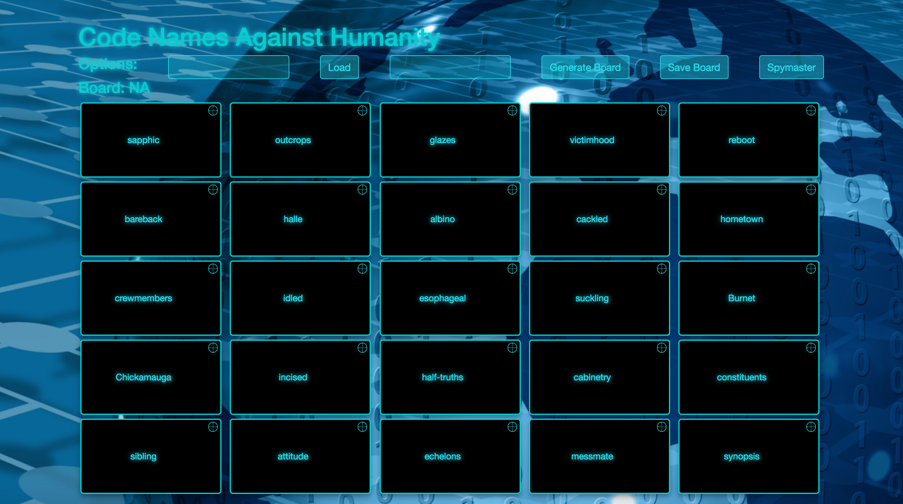

# Code Names Against Humanity #
 
## For anyone who likes team games that involve guessing. ##

## Summary ##
  It's Code Names, but for terrible people. Or immature people. Or just bored people.

## Screen Shots ##
Player View:


Spy Master View:


## Problem ##
  Other versions of Codenames either use the entire dictionary, or they restrict themslves to "Family Friendly" words. We don't role that way, and by default your boards start with words on the more innapropriate side of things. While you can still go the family friendly route, where's the fun in that? Boards can also be chosen by theme.

## Solution ##
  Create custom boards with your own words, or use the Wordnik API to find words for you (and your twisted friends)!

## Quote from You ##
  "Who needs real names or humanity when you have Code Names Against Humanity!".

## How to Get Started ##
 Run ```npm install``` to install all node modules.
 
 Run ```npm run server-dev``` to run the server.
 
 Run ```npm run react-dev``` to run webpack.
 
 Go to ```http://localhost:3000/``` to use.
 
 Make two teams. One person from each team is your spymaster.  The spymasters know which tiles belong to which team. Their job is to get their teammates to guess the correct tiles with clues that consist of a single word and a number of tiles related to that way. The first team to go has 9 words to guess, and the second team has 8 words to guess in total. teams alternate guessing. Be careful though, there are tiles that belong to neither team, and one of those (the assassin) loses the game for the team that guesses it.
 You need two computers to use this properly. The Spymasters will have one computer, and everyone else will use the other. First use one of the computers to setup the board words to everyone's liking. Save the board, and then use the generated board to name to load it one the other computer. The spymasters will click the "Spymaster" button on their computer to so that they can see the which tiles belong to which team.
